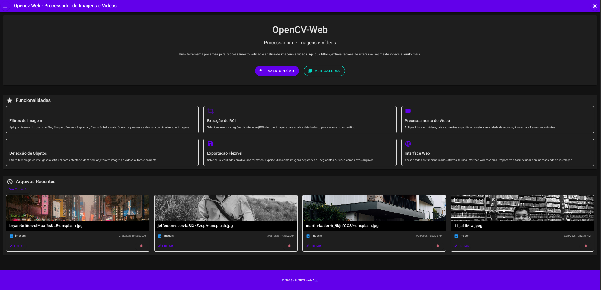
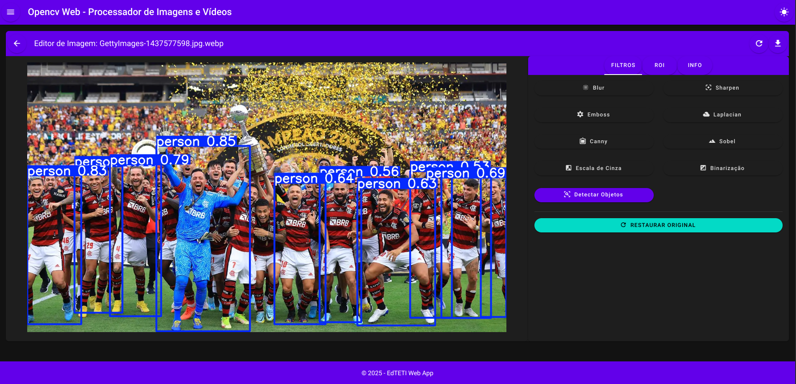
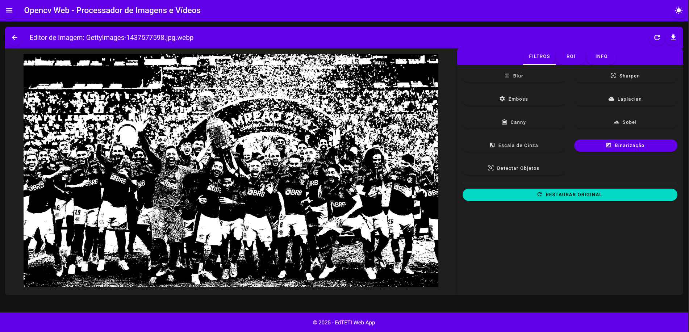
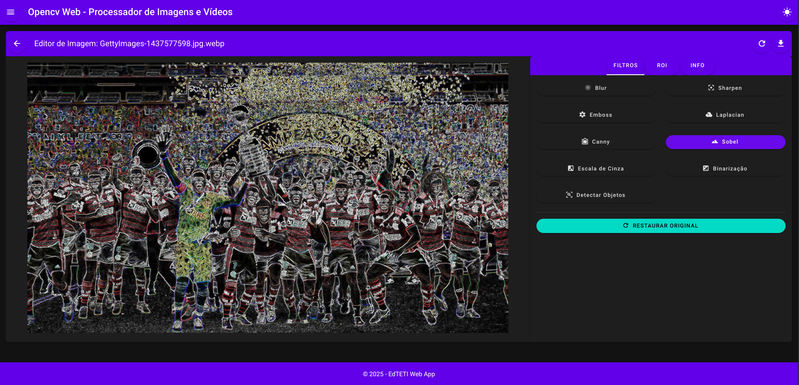

# 🎯 OpenCV Web - Processador de Imagens e Vídeos

Uma aplicação web moderna e intuitiva para processamento de imagens e vídeos utilizando OpenCV, com backend em Django e frontend em Vue.js. Esta ferramenta permite aos usuários realizar diversas operações de processamento de imagem e vídeo através de uma interface web amigável.

## ✨ Funcionalidades Principais

### 🖼️ Processamento de Imagens


---

---

---


- 📤 Upload e gerenciamento de imagens
- 🧩 Filtros avançados:
  - 🌫️ Blur (Desfoque)
  - ✨ Sharpen (Nitidez)
  - 🏔️ Emboss (Relevo)
  - 📐 Laplacian (Detecção de bordas)
  - 🔍 Canny (Detecção de bordas)
  - 📊 Sobel (Gradientes)
- 🔘 Conversão para escala de cinza
- ⚪⚫ Binarização de imagens
- 🎯 Detecção de objetos utilizando YOLO
- ✂️ Extração de regiões de interesse (ROI)

### 🎬 Processamento de Vídeos

- 📤 Upload e gerenciamento de vídeos
- 🎞️ Aplicação de filtros em tempo real
- 🔪 Segmentação de vídeos
- 👁️ Detecção de objetos em vídeos usando YOLO
- 📸 Extração de frames específicos

## 🛠️ Tecnologias Utilizadas

### 🔙 Backend

- **🐍 Django**: Framework web Python
- **🔌 Django REST Framework**: API RESTful
- **👁️ OpenCV**: Biblioteca de visão computacional
- **🔢 NumPy**: Processamento numérico
- **🖼️ Pillow**: Manipulação de imagens
- **🔍 YOLO**: Detecção de objetos em tempo real

### 🔜 Frontend

- **⚡ Vue.js 3**: Framework JavaScript progressivo
- **🎨 Vuetify**: Framework de componentes UI
- **🗄️ Vuex**: Gerenciamento de estado
- **🧭 Vue Router**: Roteamento
- **📡 Axios**: Cliente HTTP

## 📂 Estrutura do Projeto

```
opencvweb/
├── backend/                 # Aplicação Django
│   └── edteti_project/      # Projeto Django
│       ├── processor/       # App de processamento
│       │   ├── views.py     # Lógica de processamento
│       │   ├── models.py    # Modelos de dados
│       │   └── urls.py      # Rotas da API
│       └── edteti_project/  # Configurações do projeto
├── frontend/               # Aplicação Vue.js
│   ├── src/               # Código-fonte
│   │   ├── components/    # Componentes Vue
│   │   ├── views/        # Páginas da aplicação
│   │   ├── store/        # Gerenciamento de estado
│   │   └── router/       # Configuração de rotas
│   └── public/           # Arquivos estáticos
└── start.sh              # Script de inicialização
```

## 📋 Requisitos

- 🐍 Python 3.8+
- 📦 Node.js 14+
- 📦 npm ou yarn
- 💾 Espaço em disco para processamento de mídia

## 🚀 Como Executar

### Simples
   ```bash
   ./start.sh
   ```
   Isso irá levantar todos os servidores da aplicação
### 🔙 Backend (Django)

1. Clone o repositório e navegue até o diretório do backend:

   ```bash
   cd opencvweb/backend
   ```
2. Crie e ative um ambiente virtual:

   ```bash
   python -m venv venv
   source venv/bin/activate  # No Windows: venv\Scripts\activate
   ```
3. Instale as dependências:

   ```bash
   pip install -r requirements.txt
   ```
4. Configure o banco de dados:

   ```bash
   cd edteti_project
   python manage.py makemigrations
   python manage.py migrate
   ```
5. Inicie o servidor:

   ```bash
   python manage.py runserver
   ```

### 🔜 Frontend (Vue.js)

1. Navegue até o diretório do frontend:

   ```bash
   cd opencvweb/frontend
   ```
2. Instale as dependências:

   ```bash
   npm install
   ```
3. Inicie o servidor de desenvolvimento:

   ```bash
   npm run serve
   ```

## 🌐 Acessando a Aplicação

- 🖥️ Frontend: http://localhost:8080
- 🔌 Backend API: http://localhost:8000

## ⚙️ Configurações Adicionais

### 🔍 YOLO

- O modelo YOLO pode ser personalizado colocando o arquivo do modelo em `backend/edteti_project/models/modelo_personalizado.pt`
- Por padrão, o sistema utiliza o modelo YOLOv8n

### 💾 Armazenamento

- As imagens e vídeos processados são armazenados em `backend/edteti_project/media/`
- Certifique-se de que o diretório tem permissões adequadas

## 👥 Contribuindo

Contribuições são bem-vindas! Por favor, sinta-se à vontade para submeter pull requests.

## 📄 Licença

Este projeto está sob a licença MIT. Veja o arquivo LICENSE para mais detalhes.
